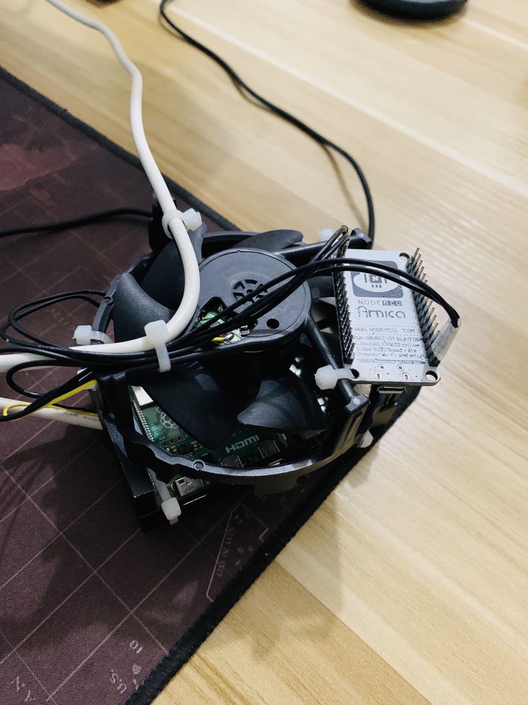

# RpiFanPwm

树莓派通过UDP发送PWM指令控制风扇转速.
硬件平台为`ESP8266`WIFI版本，树莓派为4B.
> 因为通过树莓派直接PWM控制风扇一直不成功，我怀疑是树莓派的PWM引脚有些问题，所以只能绕路通过单片机硬件PWM，树莓派发送PWM数据到单片机.




### 树莓派
发送端为rust编写，可以使用下面命令编译为可执行文件:
```sh
cd report
cargo build --release
```
编译完成之后可执行文件在 `~/report/target/release` 中.</br>
如果你需要自行定义单片机的地址和端口，则更改 `~/report/src/main.rs`中的:
```rust
const ADDR: &str = "192.168.3.6:8088";
```
将此处替换为你的地址并重新编译.


### 单片机
单片机为`Arduino IDE`工程，使用`Arduino IDE`直接打开即可.</br>
不过需要注意的是，这里我使用的是`ESP8266`这个平台，如果你的硬件型号不一样，可以调整内部头文件或者代码.</br>

源文件内部没有填写WIFI认证信息，你需要自行补齐:
```c
#ifndef STASSID
#define STASSID ""
#define STAPSK  ""
#endif
```

针脚定义:
```c
const int SPEED = D2;
const int PWM = D1;
```

UDP端口:
```c
unsigned int PORT = 8088;
```

### 安装
为了避免树莓派每次重启之后都需要手动启动进程的问题，
你可以使用自动化脚本安装服务:
```sh
./install.sh
systemdctl status rpifanpwm.service
```
服务将自动安装并开机启动.

### License
[MIT](./LICENSE)
Copyright (c) 2020 Mr.Panda.